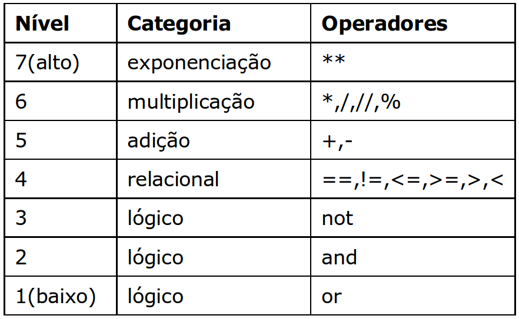

### Operadores aritméticos

Como o próprio nome já diz, são responsáveis por realizar operações matemáticas, como adição, multiplicação, divisão, subtração e assim por diante.

Os operadores aritméticos são representados pelos respectivos sinais de cada tipo de operação.

****
### Operadores relacionais e lógicos

Os operadores relacionais são utilizados para comparar valores, e os operadores lógicos trabalham com operandos booleanos.
